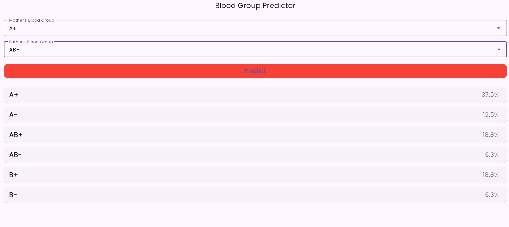

# Blood Group Predictor

*Simple yet powerful Flutter app to predict possible child blood groups based on parents' blood groups.*

---

##  Features

- Input mother’s and father’s blood group (ABO + Rh) via dropdown menus.
- On clicking **Predict**, displays all possible child blood groups along with percentages.
- Sleek and user-friendly UI using Flutter and Google Fonts.
- Genetic logic is encapsulated but never exposed—UI-focused improvements keep core logic untouched.

---

##  Demo

Insert your app’s screenshot or icon below. For example:




---

##  Installation

```bash
git clone https://github.com/Vineetsu/Bloodgroup_predictor.git
cd Bloodgroup_predictor
flutter pub get
flutter run

